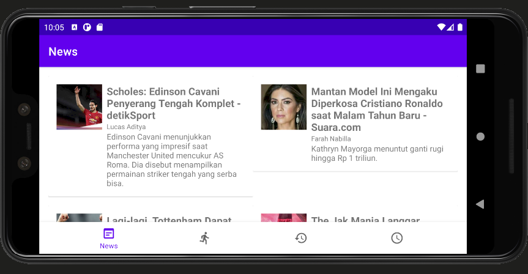
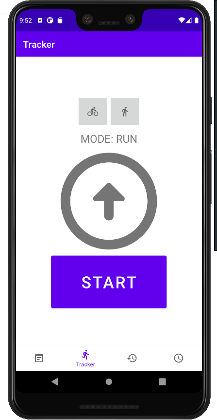
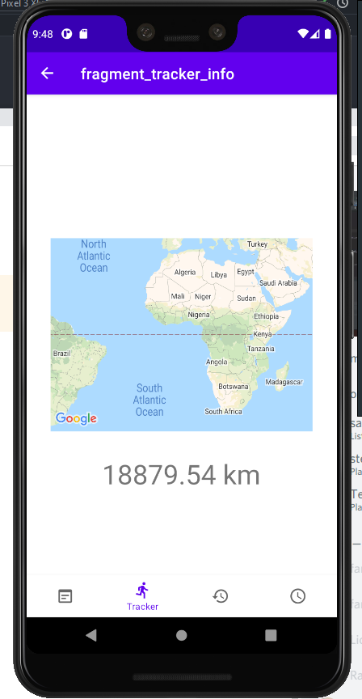

# Workout
## Deskripsi Aplikasi
**Fitness App : Workout** adalah aplikasi yang menyediakan berbagai fitur seperti *news*, *training tracker*, *training history*, dan *training scheduler*. 
## Cara Kerja
Ketika pertama membuka aplikasi, *user* akan disambut langsung dengan halaman *news* yang berisikan kumpulan berita-berita olahraga terbaru yang dihimpun dari <https://www.newsapi.org>. Lalu, ketika pengguna memencet salah satu dari berita akan keluar tampilan *web* yang bisa dibaca oleh pengguna. Lalu, ketika *handphone* dimiringkan (*landscape*), maka akan tampil dengan tampilan dua kolom. Lalu, untuk menu/halaman *tracker*, pengguna dapat memilih antara mode bersepeda ataupun mode berlari. Ketika *tracking* selesai, pengguna dapat melihat jarak tempuh untuk mode sepeda dan jumlah langkah untuk mode lari. Di menu utama *tracker* pengguna juga dapat melihat kompas. Lalu, untuk menu/halaman *history*, pengguna dapat melihat sebuah kalender tanpa fungsionalitas (hehe punten kak) Lalu, untuk menu/halaman *scheduler*, ....
## *Library* yang digunakan dan penggunaannya
- **Retrofit**, digunakan untuk *fetch* JSON yang disediakan oleh [API berikut](https://www.newsapi.org).
- **Gson**, digunakan untuk *parsing* JSON.
- **Picasso**, digunakan untuk menampilkan *thumbnail* dari berita.
- **Google Play Service**, digunakan untuk menampilkan peta statik.
## <i>Screenshot</i> Aplikasi
- Tampilan halaman *news* baik *portrait* maupun *landscape*.

- Tampilan *WebView* dari berita yang dipilih.

- Tampilan *Training Tracker*.

- Tampilan *Training History*.

## Pembagian Kerja Anggota Kelompok
- 13518092 Izharulhaq:
    - Mengerjakan *Training Scheduler*
- 13518107 Chokyi Ozer:
    - Mengerjakan *Training Tracker*
- 13518149 Stefanus Gusega Gunawan:
    - Mengerjakan *News Fragment*
