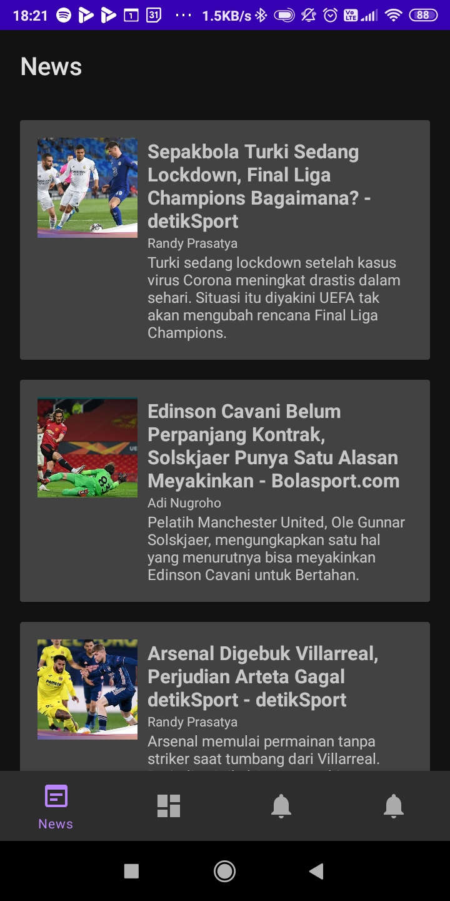
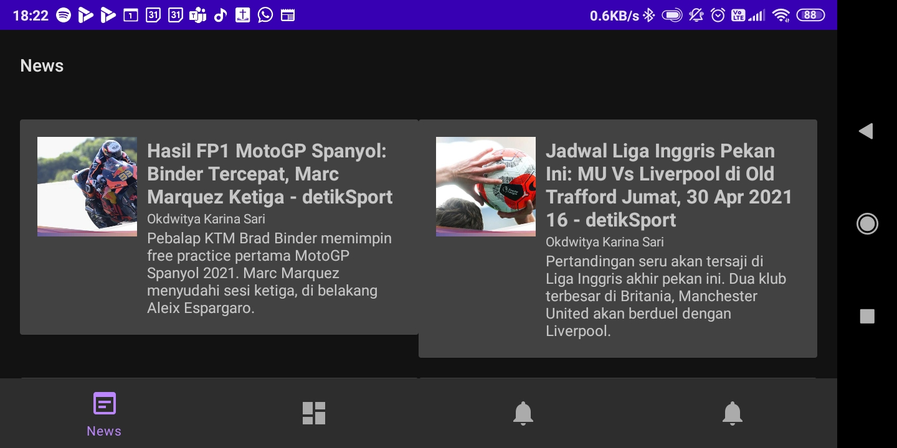

# Workout
## Deskripsi Aplikasi
**Fitness App : Workout** adalah aplikasi yang menyediakan berbagai fitur seperti *news*, *training tracker*, *training history*, dan *training scheduler*. 
## Cara Kerja
Ketika pertama membuka aplikasi, *user* akan disambut langsung dengan halaman *news* yang berisikan kumpulan berita-berita olahraga terbaru yang dihimpun dari <https://www.newsapi.org>. Lalu, ketika pengguna memencet salah satu dari berita akan keluar tampilan *web* yang bisa dibaca oleh pengguna. Lalu, ketika *handphone* dimiringkan (*landscape*), maka akan tampil dengan tampilan dua kolom. Lalu, untuk menu/halaman *tracker*, .... Lalu, untuk menu/halaman *history*, .... Lalu, untuk menu/halaman *scheduler*, ....
## *Library* yang digunakan dan penggunaannya
- **Retrofit**, digunakan untuk *fetch* JSON yang disediakan oleh [API berikut](https://www.newsapi.org).
- **Gson**, digunakan untuk *parsing* JSON.
- **Picasso**, digunakan untuk menampilkan *thumbnail* dari berita.
- **Google Play Service**, digunakan untuk menampilkan peta statik.
## <i>Screenshot</i> Aplikasi
- Tampilan halaman *news* baik *portrait* maupun *landscape*.

- Tampilan *WebView* dari berita yang dipilih.

## Pembagian Kerja Anggota Kelompok
- 13518092 Izharulhaq:
    - Ngapain
    - Ngapain
- 13518107 Chokyi Ozer:
    - Mengerjakan *Training Tracker*
    - Carry
- 13518149 Stefanus Gusega Gunawan:
    - Mengerjakan *News Fragment*
    - Ngapain
